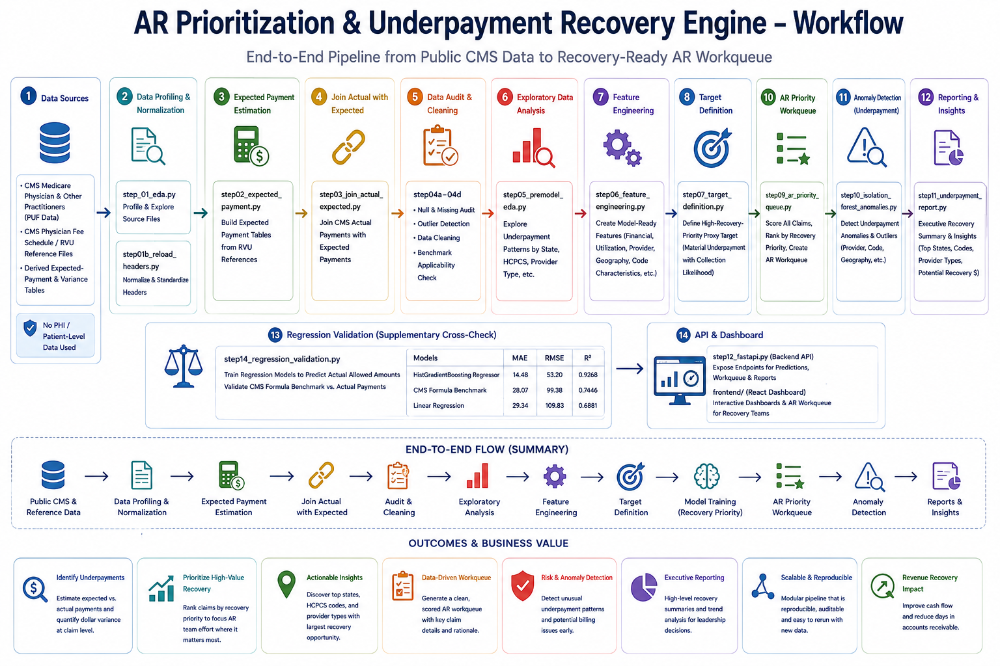
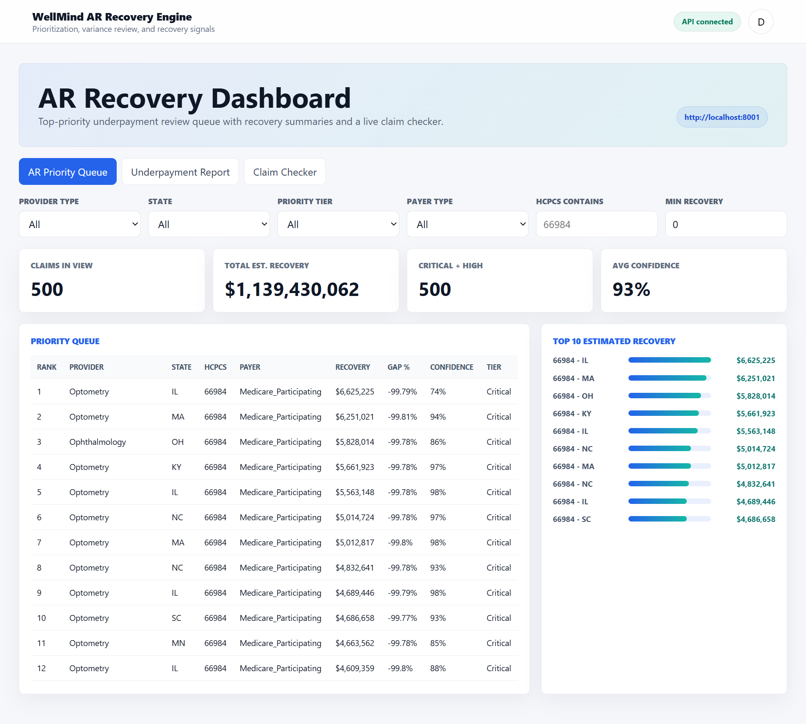
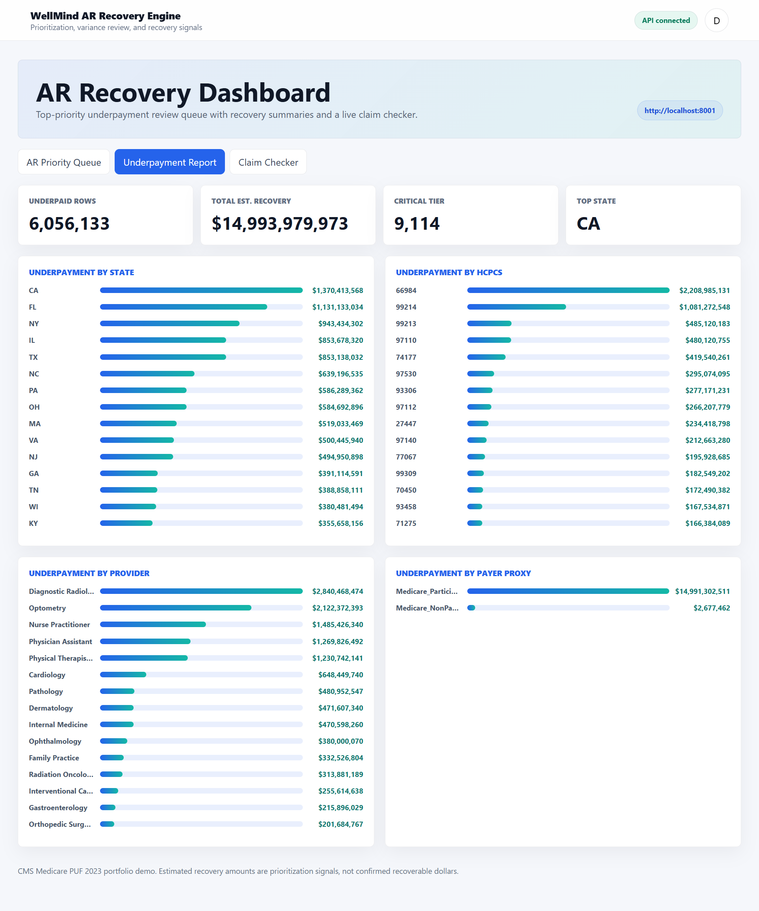
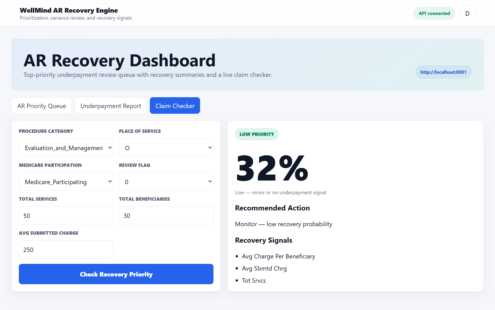

<div align="center">



# AR Prioritization & Underpayment Recovery Engine

Public-data Medicare recovery engine for expected payment benchmarking, underpayment variance detection, and AR queue prioritization.

<p>
  <a href="https://github.com/ayeshazahid170125/AR-prioritization-underpayment-recovery-engine">
    
  </a>
  
  
  
</p>

</div>

---

## Overview

Revenue Cycle teams need a practical way to identify claims that are likely underpaid and worth follow-up. This project builds a public-data proof of concept that estimates what a claim's payment should have been, flags claims that appear materially underpaid, ranks which underpaid claims AR teams should review first, and surfaces which states, HCPCS codes, and provider types drive the largest recovery opportunity.

No PHI or patient-level records are used — the pipeline runs entirely on public CMS Medicare and Physician Fee Schedule/RVU data.

---

## Key Features

- **Expected payment estimation** — builds expected-payment tables from CMS RVU reference data and joins them against actual CMS payment
- **Recovery-priority model** — a LightGBM classifier trained to flag high-recovery-priority claims, with threshold tuning for different precision/recall targets
- **AR priority workqueue** — scores and ranks every underpaid claim into Critical, High, Medium, and Standard tiers
- **Anomaly detection** — an Isolation Forest layer flags unusual underpayment patterns beyond the standard variance model
- **Regression validation** — a supplementary ML regressor cross-checks the CMS formula benchmark against actual allowed amounts
- **Live claim checker** — enter a claim's details and get an instant recovery-priority score with recommended action
- **FastAPI + React dashboard** — a live API backend with an interactive dashboard for the priority queue, underpayment reports, and claim checking

---

## Application Screenshots

<div align="center">

### AR Priority Queue
*Filterable, ranked queue of underpaid claims with recovery estimates and confidence scores.*



<br /><br />

### Underpayment Report
*Recovery opportunity broken down by state, HCPCS code, provider type, and payer.*



<br /><br />

### Claim Checker
*Enter a single claim's details and get an instant recovery-priority score and recommended action.*



</div>

---

## Model Results

Best model: **LightGBM**

| Model | Mean PR-AUC | Mean ROC-AUC | Mean F1 |
|---|---:|---:|---:|
| LightGBM | 0.8688 | 0.8791 | 0.7479 |
| Hist Gradient Boosting | 0.8663 | 0.8771 | 0.7622 |
| Random Forest | 0.8561 | 0.8653 | 0.7449 |
| Gradient Boosting | 0.8546 | 0.8639 | 0.7284 |
| Logistic Regression | 0.6921 | 0.7078 | 0.6060 |

**Final holdout metrics:** Test PR-AUC 0.8754 · Test ROC-AUC 0.8857 · Test F1 0.7577, trained on 6,142,472 rows across 23 features.

**Regression validation** (supplementary cross-check against actual CMS allowed amounts):

| Model | MAE | RMSE | R² |
|---|---:|---:|---:|
| HistGradientBoosting Regressor | 14.48 | 53.20 | 0.9268 |
| CMS Formula Benchmark | 28.07 | 99.38 | 0.7446 |
| Linear Regression | 29.34 | 109.83 | 0.6881 |

The CMS fee schedule formula remains the primary expected-payment benchmark because it's audit-defensible; the ML regressor is a supplementary validation layer, not the pricing engine.

---

## Recovery Opportunity Summary

| Metric | Value |
|---|---:|
| Underpaid queue rows | 6,056,133 |
| Estimated recovery | $14,993,979,972.64 |
| Critical tier rows | 9,114 |
| High tier rows | 173,218 |
| Top state by recovery | CA |
| Top HCPCS by recovery | 66984 |
| Top provider type | Diagnostic Radiology |

Some surgical-code rows are flagged for modifier review, since the public CMS PUF doesn't expose global surgery, bilateral, assistant-surgeon, or MPPR modifiers — client-facing totals should account for this.

---

## Project Structure

```
.
├── app/                  FastAPI service and legacy Streamlit dashboard
├── frontend/              React dashboard
├── src/                   Step-by-step payment variance and recovery pipeline
├── docs/                  Technical report and model card
├── reports/               Curated summary reports for GitHub review
├── scripts/               Helper scripts
├── run_pipeline.ps1       Rebuilds the local pipeline outputs
├── run_app.ps1            Starts the API and dashboard
├── setup_project.ps1      Creates environment and installs requirements
├── requirements.txt
└── README.md
```

Large raw CMS/RVU files, model binaries, and generated multi-million-row CSVs are intentionally excluded so the repository stays clean.

---

## Pipeline

1. **Data profiling & normalization** (`step_01_eda.py`, `step01b_reload_headers.py`) — profiles and normalizes source files
2. **Expected payment estimation** (`step02_expected_payment.py`) — builds expected-payment tables from RVU references
3. **Join actual with expected** (`step03_join_actual_expected.py`) — joins actual CMS payment with expected payment
4. **Data audit & cleaning** (`step04a`–`step04d`) — audits nulls, outliers, cleaning, and benchmark applicability
5. **Exploratory analysis** (`step05_premodel_eda.py`) — explores underpayment patterns
6. **Feature engineering** (`step06_feature_engineering.py`) — creates model-ready recovery features
7. **Target definition** (`step07_target_definition.py`) — defines the high-recovery-priority proxy target
8. **Model training** (`step08_collection_model.py`) — trains the recovery-priority model
9. **AR priority workqueue** (`step09_ar_priority_queue.py`) — scores and ranks the AR workqueue
10. **Anomaly detection** (`step10_isolation_forest_anomalies.py`) — finds underpayment anomaly patterns
11. **Reporting** (`step11_underpayment_report.py`) — creates executive recovery summaries
12. **API & dashboard** (`step12_fastapi.py`, `frontend/`) — serves the API and React dashboard
13. **Regression validation** (`step14_regression_validation.py`) — validates the CMS formula benchmark against actual allowed amounts

---

## Run Locally

**Prerequisites:** Python 3.11 or 3.12, Node.js LTS (includes `npm`)

```powershell
.\setup_project.ps1
.\run_pipeline.ps1
.\run_app.ps1
```

The app starts:
- FastAPI: `http://localhost:8001`
- Swagger docs: `http://localhost:8001/docs`
- React dashboard: `http://localhost:5173`

The legacy Streamlit dashboard is still available at `app/step13_dashboard.py` (install `requirements-streamlit-legacy.txt` separately to run it).

For Vercel deployment, deploy `frontend/` as the frontend project and set `VITE_API_BASE_URL` to the hosted FastAPI URL. Host the FastAPI service separately on Render, Railway, AWS, Azure, GCP, or another Python web host.

---

## Important Notes

- This is a portfolio/demo system based on public aggregate data.
- The target is a documented proxy for recovery priority, not true collection probability.
- Surgical-code underpayment totals can be inflated by modifier/pricing artifacts not visible in the public PUF.
- Production use would require payer-specific contracts, actual claim adjudication history, and validated recovery outcomes.

